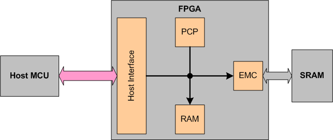
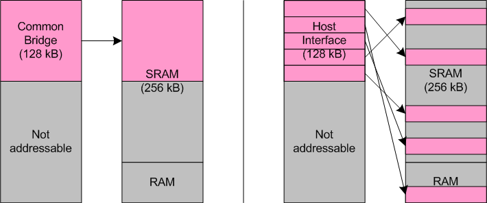
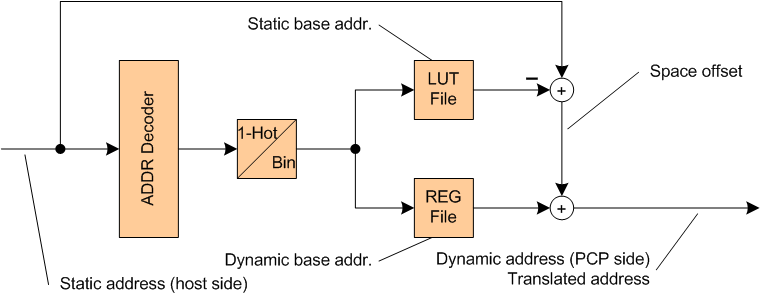
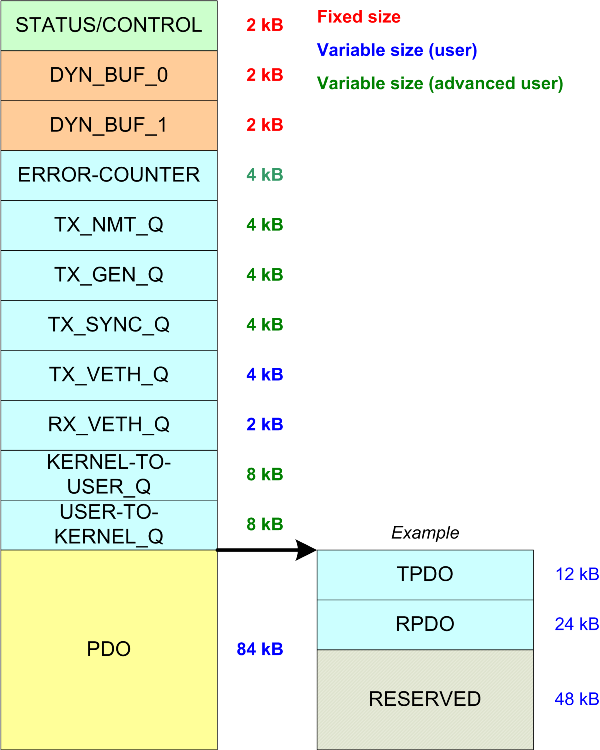

Host Interface IP-Core Documentation {#hostif}
====================================

[TOC]

# Introduction {#sec-intro}
The host interface core (hostInterface) enables connecting microprocessor units
to an embedded system on FPGA. This soft core is optimized for the open-source
industrial Ethernet protocol stack
[openPOWERLINK](http://sourceforge.net/projects/openpowerlink),
since it enables to implement the lower protocol layers in an FPGA
(POWERLINK communication processor) and process higher layers on a host processor.
The host interface core enables to reduce the user pins necessary for connecting
the host processor to the FPGA, however, it provides features that increase the
flexibility of data exchanges between host and POWERLINK communication processor.

## Features {#sec-features}
* Bridge functionality controlled by the PCP (dynamicBridge)
* MMU functionality controlled by the host (dynamicBridge)
* Synchronization interface with interrupt throttling (irqGen)
* Generic SOC interconnect interface
* External parallel memory mapped slave interface (parallelInterface)
* Modular design architecture
* Portable to any platform
* Configuration by top-level generics

# Functional Description {#sec-func}
The functional description section introduces the basics of this IP.
It starts with introducing the system environment and how to integrate the core.
The extending features of the dynamic bridge are introduced,
which highlight the difference to commonly known bridges.
Next an example of buffer management is show, which concludes using the
soft core in an application. Subsequently the synchronization generator is specified.

## Typical System integration
The primary usage of the host interface is to connect a hosting processor
to an FPGA with an embedded system. The host requires sharing any kind of data
with the soft cores in the FPGA through a parallel in-terface for
high data throughput and low latency.
The following figure shows a typical system architecture including a host MCU and
an FPGA with soft cores. The host has access through the host interface
to the on-chip memory (RAM) and also to the external memory controller (EMC and SRAM).
Note that also the PCP \- as an interconnect master \- has access to the mentioned slaves as well.

Note that the addressable memory space at the host interface is limited
by the address bus width, which is constrained to 16 bit leading to 64 kWords = 128 kB.

## Dynamic Bridge {#sec-dynbrdg}
The host interface core includes a dynamic bridge module that allows change the translation addresses during runtime.
In contrast traditional bridges are fixed to translation addresses during synthesize.
In the following figure a common bridge is compared with the host interface IP.
For the bridge it is assumed that it is able to translate up to 128 kB memory space,
which is the case also for the host interface.
The memory space of the embedded system contains of the external SRAM (256 kB) and
the on-chip memory (RAM). The traditional bridge can only address a continuous block,
hence, in the example the very first 128 kB are addressable. Note that the on-chip memory (RAM)
could not be accessed by the bridge, which degrades the flexibility of the system.
In contrast the host interface IP is able to split the 128 kB addressable space
seen by the host and access any connected core with memory mapped slave interface
in the FPGA. At host side the split buffers are seen consecutively,
which is accomplished by arithmetic calculations on the translation address.
Compared to an ordinary bridge the translation effort is higher, however,
this ensures to reduce the addressable memory at host side to a minimum.

Basically the dynamic bridge consists of the following subcomponents:
* Address decoder (addrDecode):
  Decodes the static address ranges on the host side and selects the dynamic spaces on PCP side.
* Register file (registerFile):
  Set of registers which are writeable through a slave interface from PCP and host side.
  The registers hold the memory space addresses on PCP side.
  *Note: Is prepared for replacing with on-chip memory resource to save FFs.*
* LUT file (lutFile):
  Set of look-up tables (read-only) which provide the static address mapping on host side.
* Binary encode (binaryEncoder):
  Decodes the one-hot-coded output of the address decoder to a binary selection for the register and LUT file subcomponent.

The subsequent picture visualizes the principle of the dynamic bridge implementation.
*Note that only the address path is visualized.
The input address from the host is directly forwarded to the address decoder,
which generates one-hot-coded select signals for each static address space.
If a valid address is presented to the core, the corresponding static and
dynamic base addresses are selected in the LUT and REG file.
In order to get the offset within the selected space, the static base is subtracted.
Afterwards the dynamic base is added to address the equivalent buffer in the PCP memory environment.*

## Example of Buffer Management {#sec-exbufmgmt}
This section presents an arbitrary example of a configured host interface.
It is assumed that four buffers are seen at the host side with having each a different size.
*Note that this example only considers the dynamic bridge implementation
(dynamicBridge) to demonstrate the buffer handling.*

The following table shows the buffer set, which starts at offset 0.
In total the host interface has an addressable space of 3840 byte,
which requires an address bus width of 11 bits .
Consequently this reduces pins and signal traces on the PCB.
However, if a buffer set requires more than 4096 byte (4 kB),
the address bus width must be changed accordingly.

Buffer            | Size [byte]       | Base              | High
----------------- | ----------------- | ----------------- | -----------------
0                 | 1024              | 0x0000_0000       | 0x0000_03FF
1                 | 512               | 0x0000_0400       | 0x0000_05FF
2                 | 2048              | 0x0000_0600       | 0x0000_0DFF
3                 | 256               | 0x0000_0E00       | 0x0000_0EFF

The generics of the dynamicBridge implementation have to be set as follows:

~~~{.vhd}
gAddressSpaceCount = 4
gBaseAddressArray = x"0000_0000" , x"0000_0400" , x"0000_0600" , x"0000_0E00" , x"0000_0F00"
~~~

## Synchronization Generator {#sec-syncgen}
TODO

# Memory Map {#sec-memorymap}

The host MCU is connected through a memory mapped slave interface to the FPGA.
The memory map seen by the host is presented in the following.

## Overview {#sec-overview}

The memory map seen by the host is determined by the user configuration (generics) as follows:
* Size of ERROR-COUNTER buffer
* Individual size of Tx/Rx and layer queues
* Size of Rpdo and Tpdo buffers

Note that the host interface IP-Core is constrained to max. 128 kB memory span.
Hence, a configuration exceeding that limitation leads to malfunction of the interface.

In the following overview the memory map seen by the host is visualized.
Note that the variable sizes are set to example values.

Note that some of the buffers have a fixed size (e.g. STATUS/CONTROL),
which is determined by the implementation itself.
Other buffers have a variable size, which is changeable by generic values.
Variable size for advanced users require extended knowledge
about the openPOWERLINK stack archiecture.

## Status-/Control-Registers {#sec-statusctrl}

The Status-/Control-Register definition can be found [here](\ref hostif_sc).

# Timing Specification {#sec-timingspec}

## Generic SOC interconnect interface {#sec-timingavalon}
The interconnect interface complies to the
[Altera Avalon Interface Specifications](http://www.altera.com/literature/manual/mnl_avalon_spec.pdf).

## External parallel memory mapped slave interface {#sec-timingext}
*Note that the following timing specification defines cycles and no timing values.*
*In order to get the timing values the clock period of
parallelInterface.iClk must be used!*

### Multiplexed Address-/Data-Bus {#sec-timingmux}

#### Read access {#MUX_READ_ACCESS}

* Assert CS
* Assert ALE and valid address on AD
* Hold ALE for two cycles
* After ALE deassertion hold valid address on AD for at lease three cycles
* Set AD to high-Z
* Assert RD and set valid BE
* Wait for ACK assertion
* ACK is held for two cycles
* Valid readdata is held for three cycles
* Deassert RD and BE
* Deassert CS

#### Write access {#MUX_WRITE_ACCESS}

* Assert CS
* Assert ALE and valid address on AD
* Hold ALE for two cycles
* After ALE deassertion hold valid address on AD for at lease three cycles
* Set AD to valid writedata
* Assert WR and set valid BE
* Wait for ACK assertion
* ACK is held for two cycles
* Deassert WR, BE and writedata
* Deassert CS

#### Read with following write access {#sec-timingmuxrdwr}
Refer to [Read access](#MUX_READ_ACCESS) and [Write access](#MUX_WRITE_ACCESS) for details.\n
It is allowed holding CS asserted for multiple transfers.\n

**NOTE:**\n
It is recommended waiting **two cycles** after read accesses!\n
It is recommended waiting **one cycle** after write accesses!\n

### Demultiplexed Address-/Data-Bus {#sec-timingdemux}

#### Read access {#DEMUX_READ_ACCESS}

* Assert CS
* Assert RD and set valid BE and address
* Wait for ACK assertion
* ACK is held for two cycles
* Valid readdata is held for three cycles
* Deassert RD, BE and address
* Deassert CS

#### Write access {#DEMUX_WRITE_ACCESS}

* Assert CS
* Assert WR and set valid BE, address and writedata
* Wait for ACK assertion
* ACK is held for two cycles
* Deassert WR, BE, address and writedata
* Deassert CS

#### Read with following write access {#sec-timingdemuxrdwr}
Refer to [Read access](#DEMUX_READ_ACCESS) and [Write access](#DEMUX_WRITE_ACCESS) for details.\n
It is allowed holding CS asserted for multiple transfers.\n

**NOTE:**\n
It is recommended waiting **two cycles** after read accesses!\n
It is recommended waiting **one cycle** after write accesses!\n

